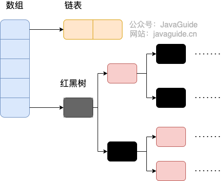

# 集合
## Map
### HashMap
- 线程不安全
- 可以存储null的key和value，但是null的key只能有一个，null的value可以有多个
- 初始容量大小：默认初始化大小为16，如果创建时给定了容量初始值，那么HashMap会将其扩充为2的幂次方
- 底层数据结构的变化：
  - 在解决哈希冲突时，如果链表长度大于阈值（默认为8）时，将链表转化为红黑树，以减少搜索时间
  - 在将链表转化为红黑树之前会对数组进行判断，如果数组的长度小于64，那么会先选择进行数组扩容
  
  

### ConcurrentHashMap
#### jdk 1.7
- 有16个segment，同时支持16个线程并发写
- 