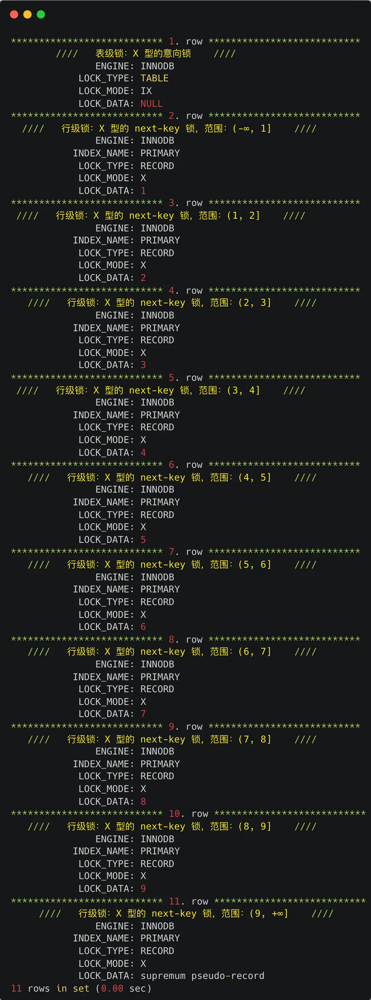
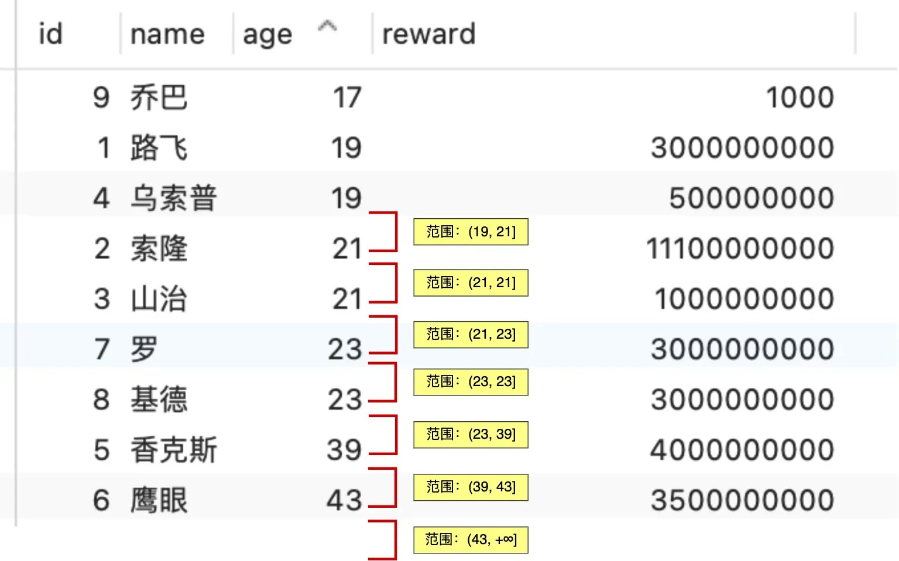

## 锁

### 行级锁
- 读已提交：只有记录锁
- 可重复读：
  - Record Lock, 记录锁， 也就是仅仅把一条记录锁上；
  - Gap Lock， 间隙锁， 锁定一个范围， 但是不包含记录本身；
  - Next-Key Lock：Record Lock + Gap Lock的组合，锁定一个范围，并且锁定记录本身

#### update没加索引问题
如果update的where条件中没有使用索引，就会全表扫描，于是就会对所有记录加上next-key锁，相当于把整个表锁住了

#### MySQL记录锁+间隙锁可以防止删除操作而导致的幻读吗？
以 `select * from user where age > 20 for update` 为例：
- 如果对于age字段来说没有建索引，那么会执行全表扫描，对主键索引上加next-key锁；在这种情况下如果有删除操作的事务，是会被阻塞的
  
- 如果对于age字段来说有建索引，那么会对索引加锁，这里会对主键索引和age索引加锁，主键索引上会加**X型的记录锁**，age索引上会加**X型的 next-key lock**，锁住一定的age范围
  